# Лабораторная работа №2
# Loki + Zabbix + Grafana

## Команда №9

**Задача**
- Подключить к тестовому сервису Nextcloud мониторинг + логирование. Осуществить визуализацию через Grafana


## 1. Логирование

Для начала был создан YAML, который содержит в себе все необходимые сервисы: Nextcloud, Loki, Promtail, Grafana, Zabbix и Postgres для него.

```
services:
  nextcloud:
    image: nextcloud:29.0.6
    container_name: nextcloud # на это имя будет завязана настройка забикса далее, так что лучше не менять
    ports:
      - "8080:80"
    volumes:
      - nc-data:/var/www/html/data

  loki: # сервис-обработчик логов
    image: grafana/loki:2.9.0
    container_name: loki
    ports:
      - "3100:3100"
    command: -config.file=/etc/loki/local-config.yaml # запуск с дефолтным конфигом

  promtail: # сервис-сборщик логов
    image: grafana/promtail:2.9.0
    container_name: promtail
    volumes:
      - nc-data:/opt/nc_data # та же самая директория, которая монтируется в Nextcloud
      - ./promtail_config.yml:/etc/promtail/config.yml
    command: -config.file=/etc/promtail/config.yml

  grafana: # сервис визуализации
    environment:
      - GF_PATHS_PROVISIONING=/etc/grafana/provisioning # просто дефолтные настройки
      - GF_AUTH_ANONYMOUS_ENABLED=true
      - GF_AUTH_ANONYMOUS_ORG_ROLE=Admin
    command: /run.sh
    image: grafana/grafana:11.2.0
    container_name: grafana
    ports:
      - "3000:3000"

  postgres-zabbix:
    image: postgres:15
    container_name: postgres-zabbix
    environment:
      POSTGRES_USER: zabbix
      POSTGRES_PASSWORD: zabbix
      POSTGRES_DB: zabbix
    volumes:
      - zabbix-db:/var/lib/postgresql/data
    healthcheck:
      test: ["CMD", "pg_isready", "-U", "zabbix"]
      interval: 10s
      retries: 5
      start_period: 5s

  zabbix-server:
    image: zabbix/zabbix-server-pgsql:ubuntu-6.4-latest # непосредственно бэкенд забикса
    container_name: zabbix-back
    ports:
      - "10051:10051"
    depends_on:
      - postgres-zabbix
    environment:
      POSTGRES_USER: zabbix
      POSTGRES_PASSWORD: zabbix
      POSTGRES_DB: zabbix
      DB_SERVER_HOST: postgres-zabbix

  zabbix-web-nginx-pgsql:
    image: zabbix/zabbix-web-nginx-pgsql:ubuntu-6.4-latest # фронтенд забикса
    container_name: zabbix-front
    ports:
      - "8082:8080" # внешний порт можно любой по своему желанию
    depends_on:
      - postgres-zabbix
    environment:
      POSTGRES_USER: zabbix
      POSTGRES_PASSWORD: zabbix
      POSTGRES_DB: zabbix
      DB_SERVER_HOST: postgres-zabbix
      ZBX_SERVER_HOST: zabbix-back

volumes:
  nc-data:
  zabbix-db:
```

Далее мы создали файл `promtail_config.yml`. Он нужен для конфигурации промтейла, описывает где слушать порт, откуда читать логи, куда их отправлять:

```
server:
  http_listen_port: 9080
  grpc_listen_port: 0

positions:
  filename: /tmp/positions.yaml

clients:
  - url: http://loki:3100/loki/api/v1/push # адрес Loki, куда будут слаться логи

scrape_configs:
  - job_name: system # любое имя
    static_configs:
      - targets:
          - localhost # т.к. монтируем папку с логами прямо в контейнер Promtail, он собирает логи со своей локальной файловой системы
        labels:
          job: nextcloud_logs # любое имя, по этому полю будет осуществляться индексирование
          __path__: /opt/nc_data/*.log # здесь ищем log-файлы Nextcloud
```

Теперь можно перейти к запуску docker-compose:

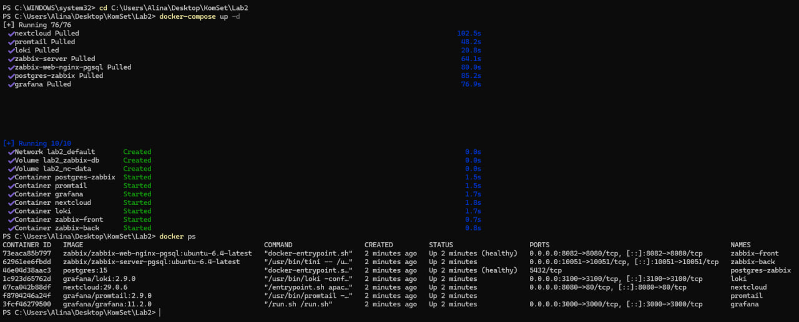

Все контейнеры в состоянии Up, значит всё хорошо. 

Переходим к инициализации Nextcloud. Заходим на веб интерфейс через внешний порт (8080:80), создаем учетку. Здесь нужно дождаться, пока закончится установка.
Nextcloud некоторое время будет создавать таблицы и базу.

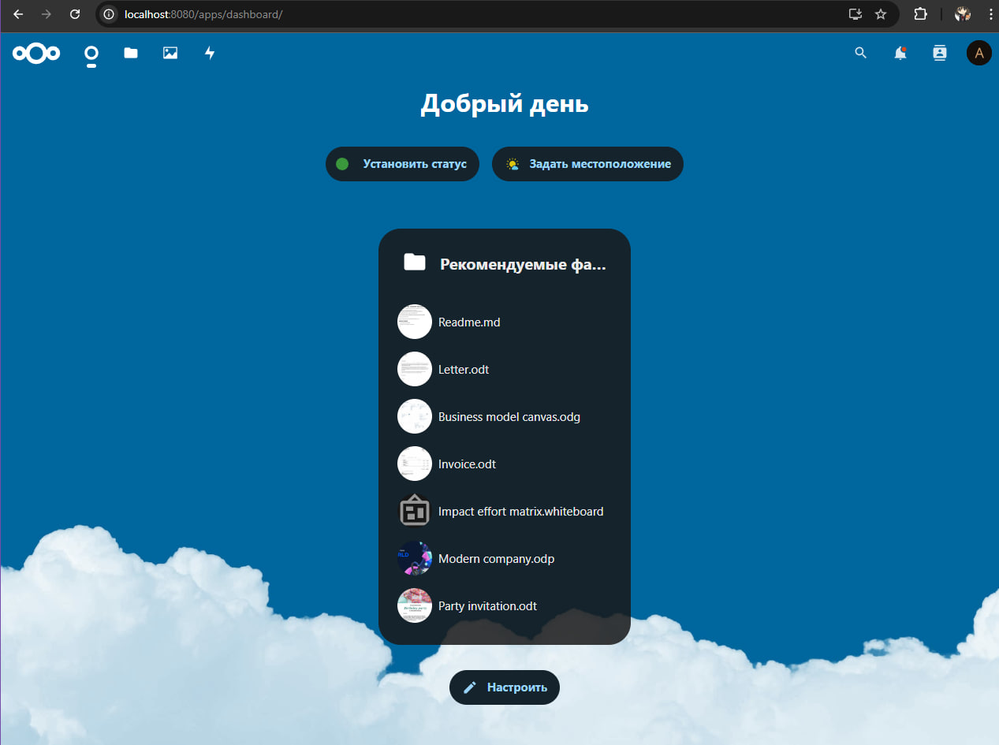

Далее нужно проверить, что Nextcloud пишет логи:

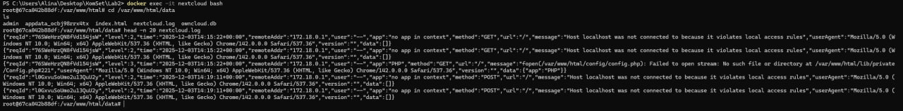

После инициализации Nextcloud нужно проверить в логах promtail, что он подцепил нужный лог-файл:

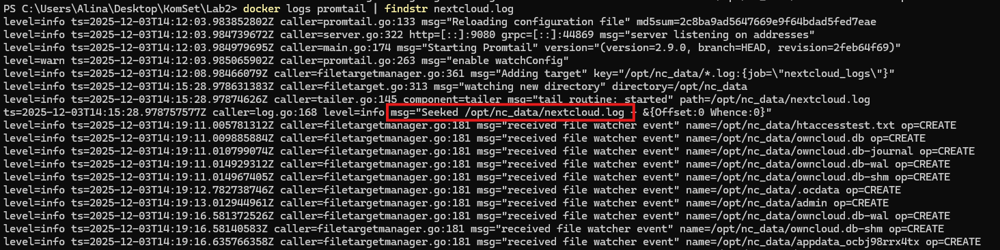

Всё хорошо, значит можно двигаться дальше.

## 2. Мониторинг

Теперь нужно перейти к настройке Zabbix. Подключаемся к `http://localhost:8082` и вводим логин `Admin`, пароль `zabbix`.

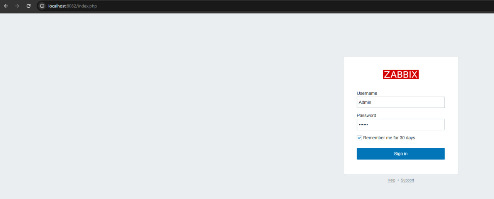

Всё отлично, и мы перешли в Zabbix - систему мониторинга, где мы будем описывать проверки и смотреть состояние сервисов.

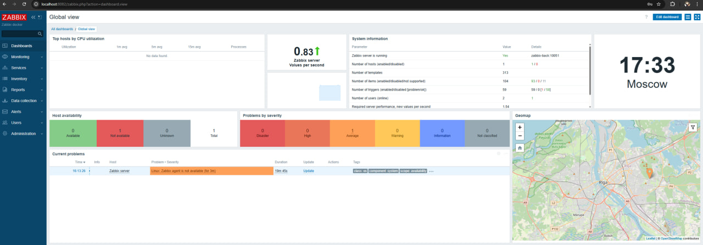

Переходим в раздел Data Collection - Templates и импортируем туда файл `template.yml`:

```
zabbix_export:
  version: '6.4'
  template_groups:
    - uuid: a571c0d144b14fd4a87a9d9b2aa9fcd6
      name: Templates/Applications
  templates:
    - uuid: a615dc391a474a9fb24bee9f0ae57e9e
      template: 'Test ping template'
      name: 'Test ping template'
      groups:
        - name: Templates/Applications
      items:
        - uuid: a987740f59d54b57a9201f2bc2dae8dc
          name: 'Nextcloud: ping service'
          type: HTTP_AGENT
          key: nextcloud.ping
          value_type: TEXT
          trends: '0'
          preprocessing:
            - type: JSONPATH
              parameters:
                - $.body.maintenance
            - type: STR_REPLACE
              parameters:
                - 'false'
                - healthy
            - type: STR_REPLACE
              parameters:
                - 'true'
                - unhealthy
          url: 'http://{HOST.HOST}/status.php'
          output_format: JSON
          triggers:
            - uuid: a904f3e66ca042a3a455bcf1c2fc5c8e
              expression: 'last(/Test ping template/nextcloud.ping)="unhealthy"'
              recovery_mode: RECOVERY_EXPRESSION
              recovery_expression: 'last(/Test ping template/nextcloud.ping)="healthy"'
              name: 'Nextcloud is in maintenance mode'
              priority: DISASTER
```

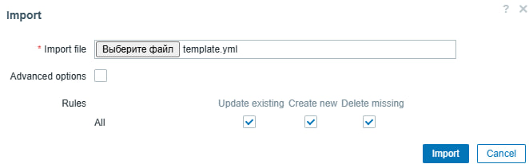

Нажимаем здесь на кнопку Import, и видим, что всё успешно:

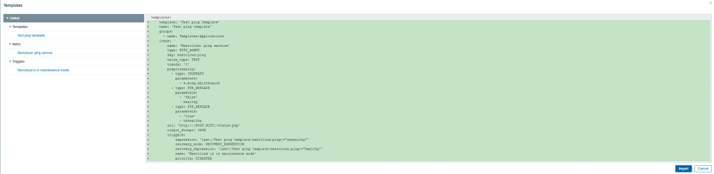

Даём приложению право обслуживать запросы по адресу nextcloud. Без этого Zabbix при HTTP-проверке будет получать “access rules violated”:

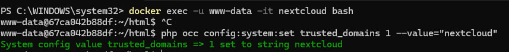

В разделе Data Collection - Hosts создаем хост nextcloud с импортированным ранее шаблоном:

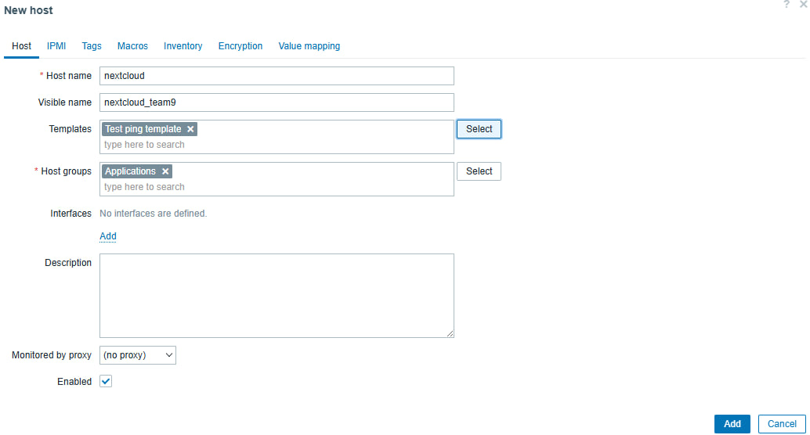

На этом этапе мы оформляем nextcloud как "мониторимый" объект, т. е. говорим, как он называется в Zabbix, по какому адресу его опрашивать, какими проверками пользоваться.

Хост создан успешно:

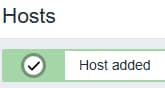

Теперь можно перейти к мониторингу логов. Для этого переходим в раздел Monitoring - Latest Data. Данные появились:

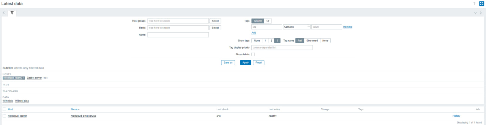

Теперь попробуем включить maintenance mode, чтобы отловить ошибку и посмотреть, как отреагирует система:

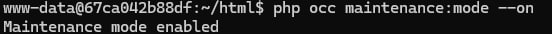

И мы её ловим:

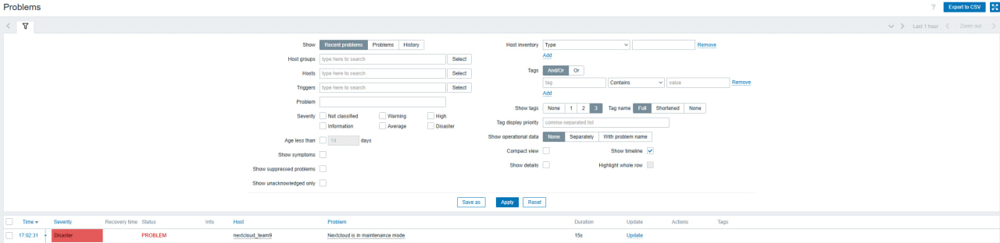

Теперь отключаем maintenance mode, чтобы посмотреть, решится ли проблема выше:

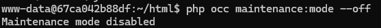

Проблема решилась (resolved):

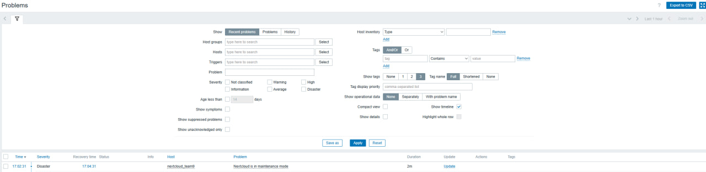

Это доказательство, что мониторинг может сигнализировать об ошибках и проблемах.

## 3. Визуализация

Для начала в контейнере Grafana нужно установить плагин `alexanderzobnin-zabbix-app` и перезапустить. Без плагина Grafana не понимает, как разговаривать с API Zabbix.

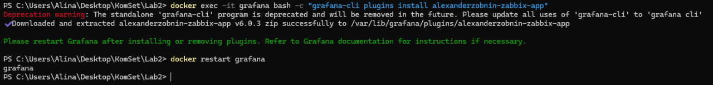

Теперь можно зайти на Grafana (`http://localhost:3000/`):

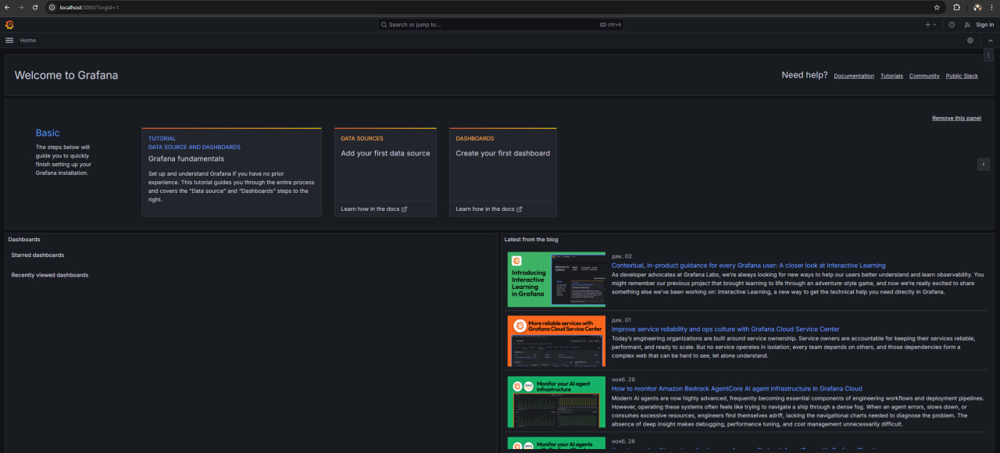

Переходим в раздел Administration - PLugins. Здесь нужно активировать Zabbix, чтобы потом использовать его для создания datasource.

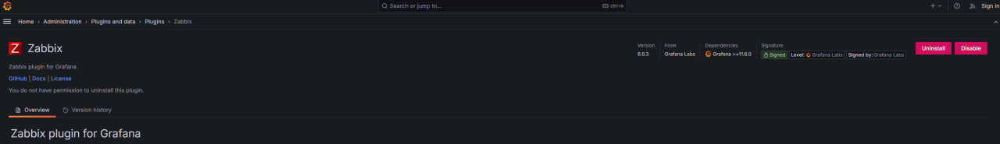

Далее нужно подключить Loki к Grafana, для этого переходим в раздел Connections - Data sources - Loki. В настройках задаем адрес `http://loki:3100` и любое имя, сохраняем:

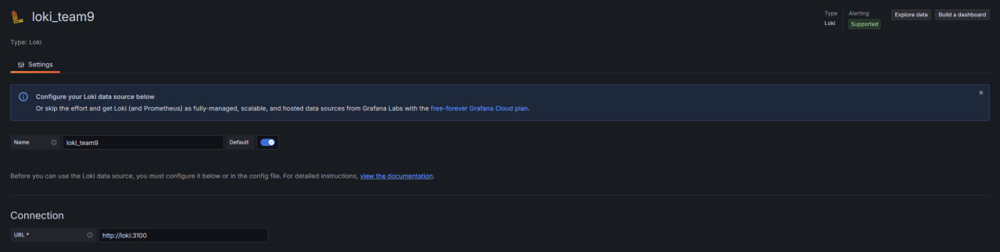

То же самое делаем с Zabbix, создаем новый датасурс, в качестве url указываем `http://zabbix-front:8080/api_jsonrpc.php`, заполняем юзернейм (`Admin`) и пароль (`zabbix`), добавляем любое имя и сохраняем:

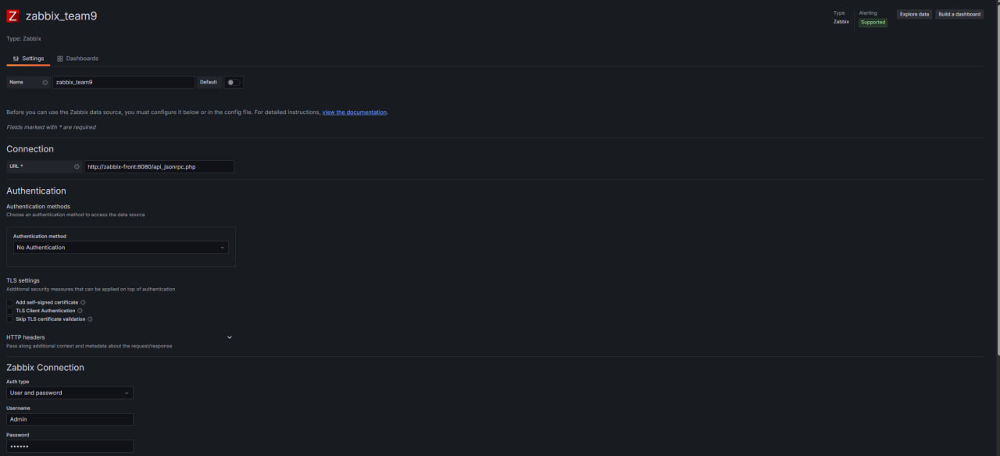

В итоге мы создали два датасурса.

Открываем Explore, выбираем в качестве источника Loki, индекс - job. Ставим фильтр на последение 3 часа (чтобы точно подтянуть все) и видим свои логи:

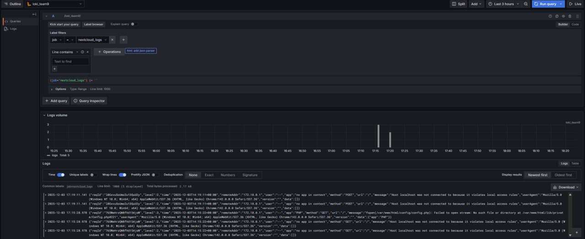

Повторяем с Zabbix, выставляем все фильтры и смотрим:

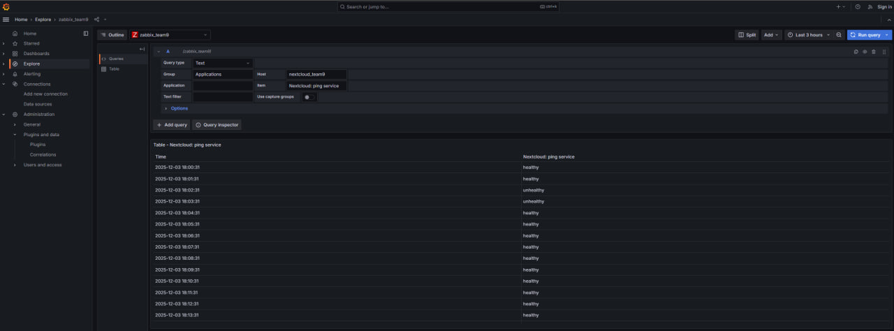

## Задание: "поиграться" с запросами

Для примера мы попробовали поставить `query type = Triggers` для Zabbix, чтобы отследить количество открытых проблем и ошибок, но таковых не оказалось:

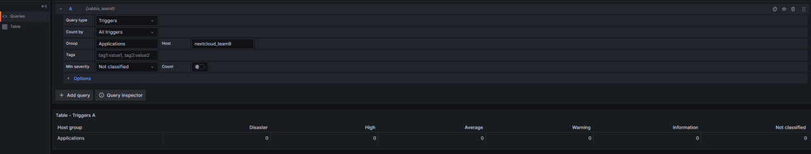

Для Loki мы попробовали отследить все логи с ошибками, поставив больший временной отрезок, но логов с ошибками мы тоже не нашли:

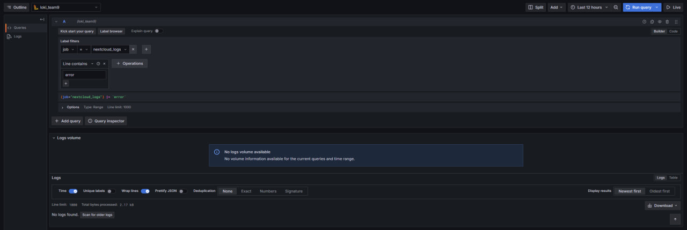

## Задание: построение дашбордов

Для построения дашбордов в Grafana переходим в раздел Dashboards - New Dashboard:

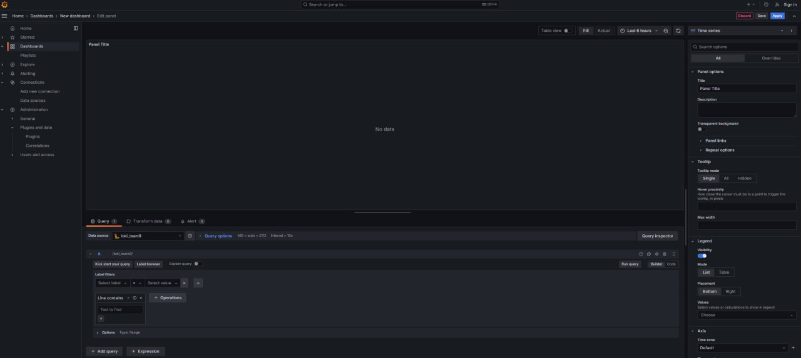

### Zabbix состояния

В своих логах для Zabbix мы имеем состояния healthy/unhealthy. Немного покопавшись в настройках дашборда, у нас получился такой светофор:

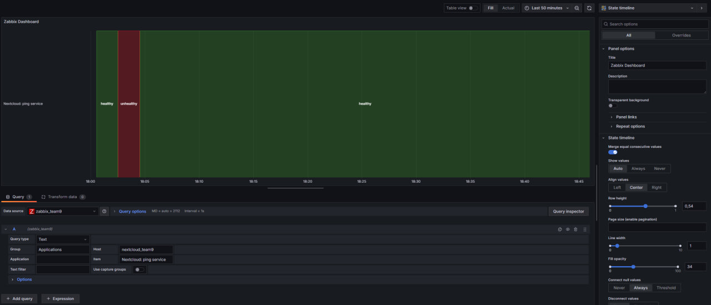

### Таблица логов Loki

Выбрав в качестве источника данных Loki, мы создали дашборд в виде таблицы:

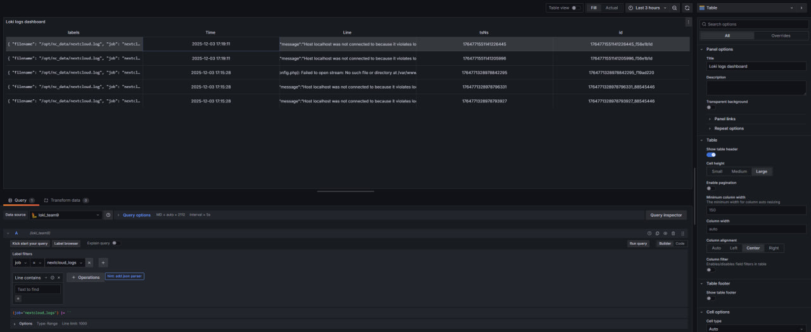

## Ответы на вопросы

### Чем SLO отличается от SLA?

*SLA* - это обещание пользователю доступности сервера. Например: сервис доступ 99,99% времени. Является обязательством с последствиями при нарушении

*SLO* - цель, к которой стремится команда. Например 99,995% доступности. Внутренняя цель без юридических последствий

### Чем отличается инкрементальный бэкап от дифференциального?

*Инкрементальный бэкап* копирует только те данные, которые изменились после последнего бэкапа любого типа: полного или предыдущего инкрементального

*Дифференциальный* бэкап копирует все изменения, сделанные с момента последнего полного бэкапа.

Инкрементальный меньше и делается быстрее, но восстанавливать его сложнее; дифференциальный больше, но восстанавливается проще.

### В чем разница между мониторингом и observability?

*Мониторинг* - это сбор определённых метрик и событий, чтобы находить известные проблемы и отслеживать состояние системы.

*Observability* - это способность системы давать достаточно метрик, логов, трейсов, чтобы понять почему что-то произошло.

Различия:
1. Мониторинг следит, не случилась ли проблема. Работает по заранее заданным метрикам
2. Observability помогает понять, почему проблема случилась, даёт информацию для нахождения причины сбоя


