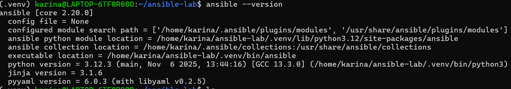
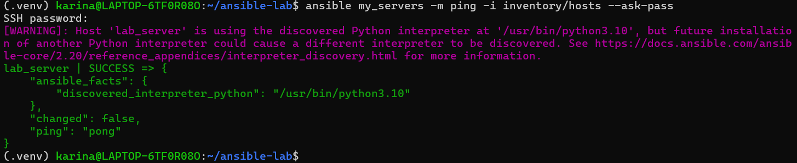
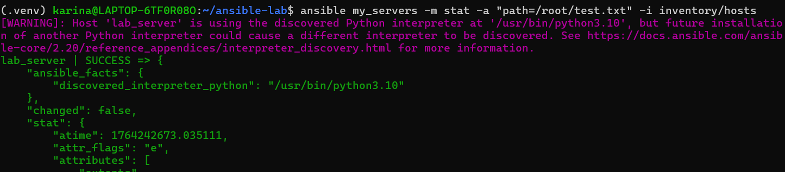
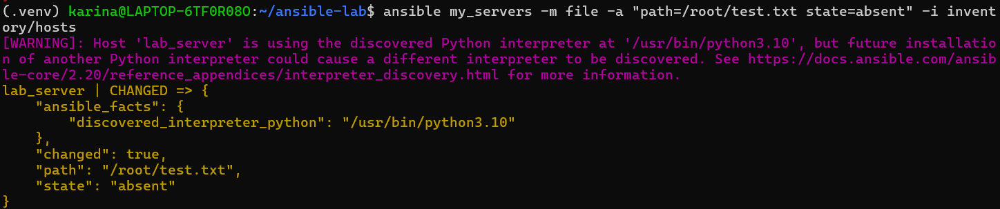
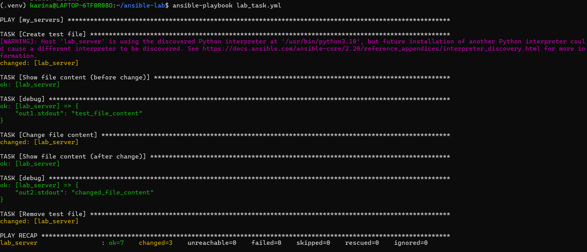
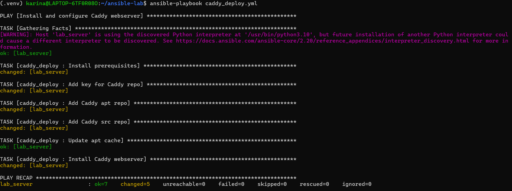
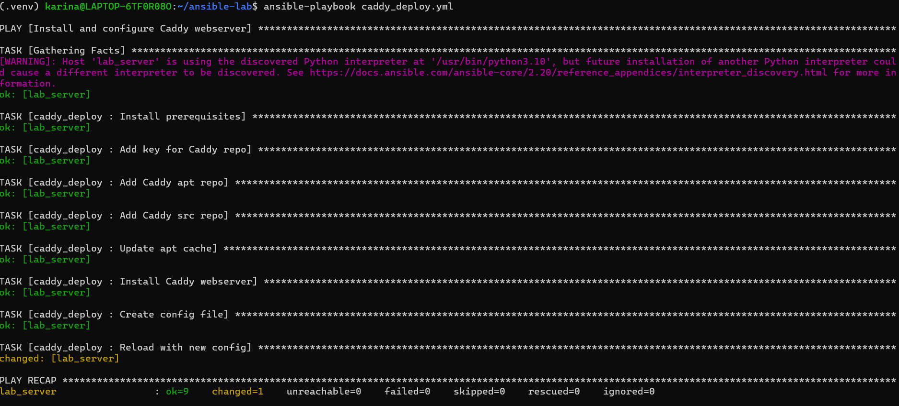
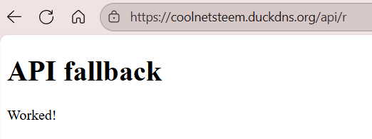

# Отчет по лабораторной работе 2

## Задание

## Выполнение

### Работа с Ansible

Будем выполнять задание через WSL2.

1. Проверим есть ли pip:


2. Установим pip командой `sudo apt install python3`:

3. Создаем папку проекта и создаем виртуальное окружение:
```
mkdir ansible-lab
sudo apt install -y python3-venv
python3 -m venv .venv
source .venv/bin/activate
```

4. Создаем виртуальное окружение:

```
source .venv/bin/activate
```


5. Установим Ansible командой `pip install ansible`:



6. Создаем файл конфигурации Ansible `ansible.cfg`:

```
touch ansible.cfg
cat > ansible.cfg << END
> [defaults]
> inventory = inventory/hosts
> host_key_checking = false
> remote_user = root
> END
```

7. Создаем папку inventory и файл hosts:

```
mkdir inventory
cd inventory
touch hosts
cat > hosts << END
> [my_servers]
> lab_server ansible_host=178.72.139.75 ansible_user=root
> END
```

8. Проверяем ping до удаленного сервера:



9. Чтобы не прописывать пароль создадим ssh:

```text
ssh-keygen -t ed25519 -f ~/.ssh/id_ed25519-labSet
eval "$(ssh-agent -s)"
ssh-add ~/.ssh/id_ed25519-labSet
ssh-copy-id -i ~/.ssh/id_ed25519-labSet.pub root@178.72.139.75
```

10. Проверим доступность:


11. Создание файла на удаленном сервере `ansible my_servers -m shell -a 'echo test_file_content > $HOME/test.txt' -i 
inventory/hosts`:


12. Проверим наличие файла на удаленном сервере `ansible my_servers -m stat -a "path=/root/test.txt" -i inventory/hosts`:



Файл существует

13. Удалим файл `ansible my_servers -m file -a "path=/root/test.txt state=absent" -i inventory/hosts`:



14. Создадим playbook для выполнения команды на удаленном сервере:

```
---
- hosts: my_servers
  gather_facts: false

  tasks:
    - name: Create test file
      copy:
        dest: /root/test.txt
        content: "test_file_content\n"

    - name: Show file content (before change)
      command: cat /root/test.txt
      register: out1
      changed_when: false

    - debug:
        var: out1.stdout

    - name: Change file content
      copy:
        dest: /root/test.txt
        content: "changed_file_content\n"

    - name: Show file content (after change)
      command: cat /root/test.txt
      register: out2
      changed_when: false

    - debug:
        var: out2.stdout

    - name: Remove test file
      file:
        path: /root/test.txt
        state: absent
```

15. Запустим playbook командой `ansible-playbook playbook.yml`:



### Работа с Caddy

1. Создаем папку с ролями и инициализируем исходное конфигурационное дерево:

```
mkdir roles && cd roles
ansible-galaxy init caddy_deploy
```


2. Наполняем файл `roles/caddy_deploy/tasks/main.yml` следующим содержимым:

```
---
# tasks file for caddy_deploy

- name: Install prerequisites
  apt:
    pkg:
    - debian-keyring
    - debian-archive-keyring
    - apt-transport-https
    - curl
    
- name: Add key for Caddy repo
  apt_key:
    url: https://dl.cloudsmith.io/public/caddy/stable/gpg.key
    state: present
    keyring: /usr/share/keyrings/caddy-stable-archive-keyring.gpg
    
- name: add Caddy repo
  apt_repository:
    repo: "deb [signed-by=/usr/share/keyrings/caddy-stable-archive-keyring.gpg] https://dl.cloudsmith.io/public/caddy/stable/deb/debian any-version main"
    state: present
    filename: caddy-stable
    
- name: add Caddy src repo
  apt_repository:
    repo: "deb-src [signed-by=/usr/share/keyrings/caddy-stable-archive-keyring.gpg] https://dl.cloudsmith.io/public/caddy/stable/deb/debian any-version main"
    state: present
    filename: caddy-stable
    
- name: Install Caddy webserver
  apt:
    name: caddy
    update_cache: yes
    state: present
```

3. Создаем playbook `caddy_playbook.yml` со следующим содержимым:

```
--- 
- name: Install and configure Caddy webserver
  hosts: my_servers
  become: true
  roles:
    - caddy_deploy
```

4. Запускаем playbook командой `ansible-playbook caddy_playbook.yml`:



5. Проверяем работу Caddy:


### Домен и настройка Caddyfile

1. Создадим домен на duckdns.org:


2. Создадим файл templates/Caddyfile.j2 со следующим содержимым: !

```
{{ domain_name }} {
        root * /usr/share/caddy
        file_server

        log {
                output file {{ log.file }}
                format json
                level {{ log.level }}
        }

        # Добавляем проксирование
        handle_path /api/* {
                rewrite * /index.html
        }
}
```

3. Наполняем файл vars/main.yml следующим содержимым:

```
---
# defaults for caddy_deploy
domain_name: coolnetsteem.duckdns.org
upstream: 178.72.139.75:443
log:
    file: /var/log/caddy_access.log
    level: "INFO"
```

4. Добавить в tasks/main.yml новые шаги: !

```
- name: Create config file
  template:
    src: templates/Caddyfile.j2  # Откуда берем
    dest: /etc/caddy/Caddyfile  # Куда кладем

- name: Deploy index.html
  copy:
    src: index.html
    dest: /usr/share/caddy/index.html
    
- name: Reload with new config
  service:
    name: caddy
    state: reloaded
```

5. Создаем index.html в files:

```
<!doctype html>
<html lang="ru">
<head>
  <meta charset="utf-8" />
  <title>API fallback</title>
</head>
<body>
  <h1>API fallback</h1>
  <p>Worked!</p>
</body>
</html>
```

6. Выполняем playbook снова:

```text
ansible-playbook caddy_playbook.yml
```



6. Проверяем страницы в браузере:




7. Подключаемся к удаленному серверу и останавливаем его:

```
ssh root@178.72.139.75
systemctl stop caddy
```

## Вывод:

В ходе выполнения лабораторной работы мы научились работать с Ansible, создавать playbook и роли, а также настраивать и 
деплоить веб-сервер Caddy с использованием Ansible. Мы также настроили домен, добавили проксирование на файл html и 
проверили работу сервера через браузер.